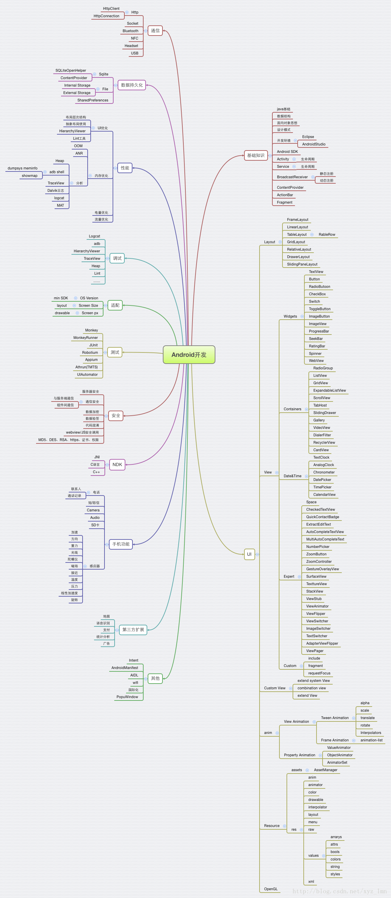
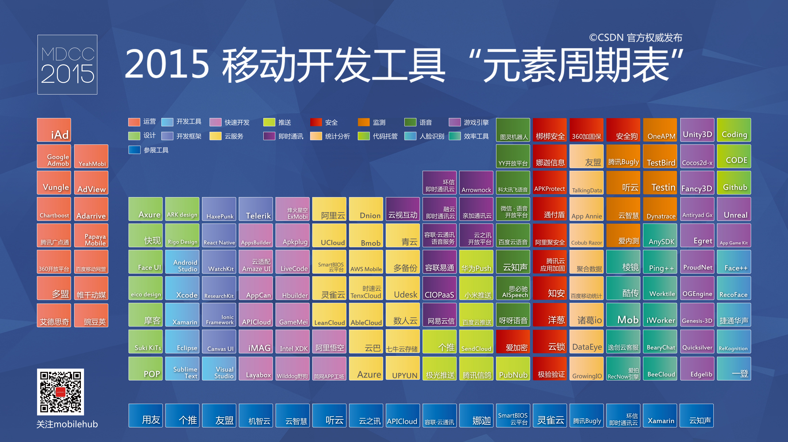
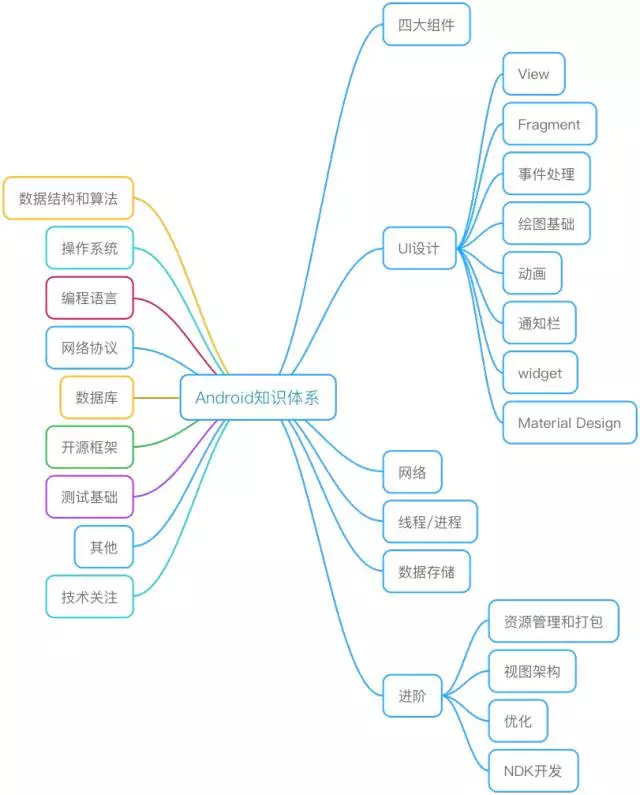

# Android 实战手册

## Y Android 知识点

### 基础篇
### 进阶篇
### 高级篇
### 开源项目学习
### 编码规范
### 案例实践
### 源码阅读

### Android Map  

### 基础篇

#### [java 基础知识](./android_java.md)

#### [Activity](./android_activity.md)

#### [Service](./android_service.md)

#### [View](./android_view.md)

#### [BroadCast](./android_broadcast.md)

#### [ContentProvider](./android_contentprovider.md)

#### [Application](./android_application.md)

#### [Android Proguard 混淆](./android_proguard.md)

#### [Android Reflection 反射调用](./android_reflection.md)

#### [Android Permission 权限管理](./android_systempermissions.md)

#### [数据格式处理](./android_2_data.md)

### [多线程](./android_thread.md)

### [进程](./android_process.md)

### [Android Fragment](./android_fragment.md) 

### [动画](./android_animation.md)

### [ViewPager](./android_viewpager.md)

### [RecyclerView](./android_recyclerview.md)

### [Andorid事件分发机制](./android_event.md)

### [Andorid数据存储](./android_data.md)

### 进阶篇

#### [性能优化专项](./android_optimize.md)

#### [插件化](./android_pulgin.md)

#### [组件化](./android_module.md)

#### [网络库](./android_network.md)

#### [图片加载框架](./andorid_imageloader.md)

#### 安全

[Android 逆向](./android_decomplie.md)

[反作弊](./android_anticheat.md)

### 高级篇

[Android系统源码分析--Process启动过程](https://juejin.im/post/59ba055ef265da064a0f232b)

[OpenGL](./android_3_opengl.md)

### [Programmer](./programmer.md)

### 其他

#### [视屏播放相关](./android_video.md)

#### 黑科技
[Android卸载监听实现](http://www.jianshu.com/p/189e319a5c45)

[AD SDK](./market/android_4_ad_sdk.md)

### Y OPEN SOURCE

[YOkHttp](./y_open_source/y_ok_http.md)

### Public

[开放通用Api](https://github.com/MZCretin/RollToolsApi)

[发布开源库](http://blog.chengdazhi.com/index.php/217?hmsr=toutiao.io&utm_medium=toutiao.io&utm_source=toutiao.io)

[From @author 张兴业 http://blog.csdn.net/xyz_lmn](http://blog.csdn.net/xyz_lmn/article/details/41411355)

### 支付

[Android快速集成微信支付](http://sunzq1993.com/2017/02/17/Android%E5%BF%AB%E9%80%9F%E9%9B%86%E6%88%90%E5%BE%AE%E4%BF%A1%E6%94%AF%E4%BB%98/)

# Doc
Just something markable.

[图集功能，查看大图，进行手势缩放](https://github.com/crazyandcoder/ImageZoom)

[虎三说Handler](./android_handler.md)

1、ListView 中局部刷新Item

[国内Top500Android应用分析报告](http://mp.weixin.qq.com/s?__biz=MzA5OTMxMjQzMw==&mid=2648112527&idx=1&sn=b23c1b5f3e32e343ad96d705bd4d63ff&scene=2&srcid=0711GL3B90iyRPmjRKTBN1I0&from=timeline&isappinstalled=0#wechat_redirect)

[面试感悟：一名3年工作经验的程序员应该具备的技能](http://mp.weixin.qq.com/s?__biz=MzI1MTA3Mzk4Mg==&mid=2651020152&idx=1&sn=31706c082faf35c74a5ac29efbbbc3aa&chksm=f20f7fa9c578f6bfab1d34c8a264541e625b0a0c8ce4a1900549d62e7f0309647eab7168ecd1&mpshare=1&scene=1&srcid=0217VZ9RuHDTbYXKHfJcOELH#rd)

[Android消息机制—sdk源码解读之旅](https://zhuanlan.zhihu.com/p/25222485?utm_source=gank.io&utm_medium=email&refer=levent-j)

[【FreeBuf年终策划】2017年最好用的Android渗透工具合集](http://www.freebuf.com/sectool/124507.html)

[Android技术周报](http://www.atatech.org/articles/73880/?flag_data_from=mail_daily_recommend&uid=130616)

[jsoup爬虫获取数据](http://blog.csdn.net/qq_30379689/article/details/55005796)

Crash搜集
https://bugly.qq.com
Bugly，腾讯出品的SDK，对Crash搜集的体验非常赞，能搜集到JNI层的奔溃以及监控线上的ANR问题。

https://try.crashlytics.com/
Crashlytics，国外的一个SDK，我自己没用过，但是用过的朋友对它的评价颇高。

https://github.com/ACRA/acra
ARCA，一个开源的崩溃日志搜集器，轻松让你实现客户端的崩溃日志上传到后台，如果你不喜欢接入别人家的SDK，可以使用它。有一个不足之处，就是它搜集不到JNI层的奔溃。

https://github.com/google/android-classyshark
Classyshark，轻松查看apk内部每个包的方法数，用了哪些开源库，同样拿知乎开刀做例子。

https://github.com/JesusFreke/smali/wiki/smalidea
smali代码调试插件，你以为没有拿到安卓Java源码就不能调试了吗？图样图森破了吧。

https://www.hex-rays.com/products/ida/
IDA Pro，逆向大利器，不管你是smali还是so文件，照样动态调试你。

注意，这些用来涨知识就好，别干坏事！

https://github.com/zzz40500/GsonFormat
根据JSON数据快速生成Java实体类，又一波解放生产力。

* [反编译](./android_decomplie.md)

通过Android API Hook技术，即通过动态代理等方法替换关键节点

[Android 插件化系列第（一）篇 ---Hook 技术之 Activity 的启动过程拦截](https://juejin.im/entry/58a15712b123db16a3e0afc1)

[Android逆向从未如此简单](https://juejin.im/post/58cc92a1b123db00532757cc?utm_source=gold_browser_extension)

[Android App 沉浸式状态栏解决方案](http://jaeger.itscoder.com/android/2016/02/15/status-bar-demo.html)

[Android卸载监听实现](http://www.jianshu.com/p/189e319a5c45)

[提高代码质量－工具篇](http://www.atatech.org/articles/58486)

[Android上如何在发生崩溃时抓取日志](http://www.atatech.org/articles/58418)

[章鱼店长Andfix接入与插件扩展](http://www.atatech.org/articles/57735)

[EasyAdapter for Android 高效列表开发解决方案](http://www.atatech.org/articles/57535)

[Android解决ImageSpan不居中的问题](http://www.atatech.org/articles/57158)

[Android上使用SVG矢量图](http://www.atatech.org/articles/56499)

[BlockCanary — 轻松找出Android App界面卡顿元凶](http://www.atatech.org/articles/56493)

[简单的安卓monkey测试脚本](http://www.atatech.org/articles/56363)

[Android 方法数杂谈](http://www.atatech.org/articles/56219)

[Android 流式布局组件 MMCherryUI](http://www.atatech.org/articles/55379)

[无痕换肤的实现方案 for Android](http://www.atatech.org/articles/24389)

[浮窗系列之越过授权使用浮窗](http://www.atatech.org/articles/55874)

[浮窗系列之窗口层级](http://www.atatech.org/articles/55780)

[DumpTool----操作Android app 私有文件的利器！](http://www.atatech.org/articles/55926)

[Android Plugin](./android_pulgin.md)

[Android Accessibility](./Accessibility/android_accessibility.md)

[异常处理](http://geek.csdn.net/news/detail/50839)

[高斯模糊](./andorid_blur.md)

### 编码规范
* [编码规范](./android_style.md)

### 工具
* [adb](./android_adb.md)
* [Android 工具](http://www.androiddevtools.cn/)

### android SDK
https://realm.io/cn/news/oredev-ty-smith-building-android-sdks-fabric/

### 伟大的 SDK Fabric SDK
易用、稳定、轻巧、灵活，很好的支持
Easy to Use
Stable
LightWeight
Flexable
WellSupport

[Design of Android application for developers, what is your favorite approach?](https://medium.com/@lolevsky/design-of-android-application-for-developers-what-is-your-favorite-approach-d16e23cf2ce3#.ur3cqnbum)

SuperToasts

#### 问题
Sdk日志跟服务器上不一致

#### 不重复发明轮子
引进一个新的日志收集模块
* 方案一：使用成熟的日志收集模块，PP使用的
* 方案二：重新写一套

考虑因素
* 实现成本（时间和人力）
* 稳定性

决定使用方案一 使用现有的

引入日志模块时候问题：
1、大量使用全局变量 Application获取context，在Library中却无法直接访问Application，为了解耦，应该当成参数传进来

#### 大量使用Application中Context在项目移动，代码复用的时候就是一场灾难，要一直改Context，所以，为了保持代码解耦，通过传参的方式

通过AndroidStudio可以将不同的模块组合使用，尽量保持解耦。

### 如何实现一个日志模块

#### 数据收集
#### 数据保存 本地持久化
#### 数据上传

JSPatch

拥有的不过是岁月留下来的经验，而不是智慧。

### [动态加载](./hotfix/README.md)

### 拍照
[你需要知道的Android拍照适配方案](http://www.jianshu.com/p/f269bcda335f)

### 分辨率适配
[（全解析）屏幕尺寸，分辨率，像素，PPI之间到底什么关系？](http://www.jianshu.com/p/c3387bcc4f6e)

### 单元测试
[在Android Studio中进行单元测试和UI测试](http://www.jianshu.com/p/03118c11c199)

### 工具
[ADB](./awesome_adb/README.md)

### 反编译
[Android apk 的反编译及保护杂谈](http://www.jianshu.com/p/caee73ca8963)

### 发布
[发布Android studio项目到本地Maven仓库](http://www.jianshu.com/p/8d7d0cc8fcc3)
[Android Studio发布库到Jcenter并推送到Maven Central最新超级详细!!!](http://www.jianshu.com/p/fb1e0fb2d966)
[Android Studio提交库至Bintray jCenter从入门到放弃](http://www.jianshu.com/p/31410d71eaba#)

### [Android Architecture 架构](./Architecture/README.md)

### [开源项目](./android_open_source.md)

### 产品
[如何用一周时间开发一款Android APP并在Google Play上线](http://www.jianshu.com/p/b08e3ef22bce)
[从零开始开发一款Android App](http://www.jianshu.com/p/a58d15ef5c8b)
[干货IO](http://www.jianshu.com/p/d92258d76f7e?hmsr=toutiao.io&utm_medium=toutiao.io&utm_source=toutiao.io)
[我的第一款全栈side project](http://www.jianshu.com/p/39dce598faf1)
[开发一个简易的干货客户端](http://www.jianshu.com/p/fbfb666bad31)
[我的吱吱：视频图片新闻应用](http://www.jianshu.com/p/e2a8c34932a6)
[如何在没有官方API的情况下写一个第三方客户端](http://www.jianshu.com/p/b235773063e3)
[[干货]如何在一天之内完成一款具备cool属性的Android产品<简诗>](http://www.jianshu.com/p/cf496fc408b2)
[一个27岁零基础无业游民的第一个开源作品](http://www.jianshu.com/p/aef225ae1502?hmsr=toutiao.io&utm_medium=toutiao.io&utm_source=toutiao.io)
[「daza.io」这将是我独立完成全端开发的项目](http://www.jianshu.com/p/0b6e630e5cf2?hmsr=toutiao.io&utm_medium=toutiao.io&utm_source=toutiao.io)

### 开发资源

[2017年初你绝对想尝试的25个新安卓库](http://www.jcodecraeer.com/a/anzhuokaifa/androidkaifa/2017/0216/7122.html)

[我是如何自学Android，资料分享（2015 版）](http://www.jianshu.com/p/874ff12a4c01)
[Android最全开发资源](http://www.jianshu.com/p/0c36302e0ed0?hmsr=toutiao.io&utm_medium=toutiao.io&utm_source=toutiao.io)

[为开发者准备的最佳 Android 函数库（2016年版）](http://www.jianshu.com/p/3baf4b4f34b6)

[有赞移动技术团队](https://youzanmobile.github.io/)

[途牛App](https://mp.weixin.qq.com/s/CfPlVKElv2SshAbfzHfRhg)

[美团点评技术团队](http://tech.meituan.com/)

[底层原理](http://qiangbo.space/)

[Android架构学习](http://qiangbo.space/2016-09-05/AndroidAnatomy_Introduction/)

[深入理解ServiceManager](https://pqpo.me/2017/04/26/learn-servicemanager/)

[深入理解MessageQueue](https://pqpo.me/2017/05/03/learn-messagequeue/)

[Android 模块化探索与实践](http://baronzhang.com/blog/Framework/Android-%E6%A8%A1%E5%9D%97%E5%8C%96%E6%8E%A2%E7%B4%A2%E4%B8%8E%E5%AE%9E%E8%B7%B5/)

### 其他
StackTraceElement
利用线程运行栈StackTraceElement设计Android日志模块

[[Android]动态更换应用Icon](http://www.jianshu.com/p/eecfd9e0b878)

### [异常处理相关](./UncaughtExceptionHandler.md)

### [网络模块](./andorid_internet.md)

### [Resource](./android_resource.md)

Talk is cheap,show me the code.

### 总结归纳
[随想录:开发一流Android SDK](http://blog.csdn.net/dd864140130/article/details/53558011)
[android日常开发总结的技术经验60条](http://www.vmatianyu.cn/summarization-of-technical-experience.html)

[设计模式](http://blog.csdn.net/hguisu/article/category/1133340)

[设计模式](http://www.tutorialspoint.com/design_pattern/builder_pattern.htm)

错题集

android.os.BadParcelableException: ClassNotFoundException when unmarshalling
http://blog.csdn.net/lincyang/article/details/7095417

[TODO](./todo.md)

[ARouter](https://juejin.im/entry/5b72331e6fb9a009b16d42ae?utm_source=gold_browser_extension)

### 案例实践
[图片颜色提取 Android Palette](./android_case.md)

### 源码阅读
[Android LayoutInflater](https://www.jianshu.com/p/f0f3de2f63e3)
[Android LayoutInflater Factory 源码解析](https://juejin.im/post/5b52ee765188251b176a666d)

#### 体系
[蜂鸟团队移动端异常监控体系建设](https://juejin.im/post/5b874cbce51d4538b77667e3?utm_source=gold_browser_extension)

# 主题切换
[Android App切换主题的实现原理剖析](https://blog.csdn.net/watertekhqx/article/details/51320515)

## 其他
[ButterKnife](http://jakewharton.github.io/butterknife/)

## 常见问题通用解决方案

### 埋点
[JJEvent 一个可靠的Android端数据埋点SDK](https://juejin.im/post/5bbdca89e51d450e92526a3b?utm_source=gold_browser_extension)

[Android无埋点数据收集SDK关键技术](https://www.jianshu.com/p/b5ffe845fe2d)

### 悬浮窗
[Android仿微信文章悬浮窗效果](https://juejin.im/post/5bbc564df265da0aea69962a?utm_source=gold_browser_extension)

### 消息推送

WebSocket 
优点：开发成本低，数据安全，对于服务器压力较小（相对轮询）
缺点：耗电量高，容易被系统kill，需要一定的技术

[Android通过Okhttp3实现socket长连接](https://blog.csdn.net/lhy349/article/details/79699394)

Android程序log追踪工具_cooker-tracer

skype 团队出的一款新型社交 APP Wire，iOS、Android、桌面端、Mac 端、webapp 全部开源了
[Wire Swiss GmbH](https://github.com/wireapp)

[Android 架构之长连接技术](http://wingjay.com/)

[Android事件分发机制源码解析](http://allenfeng.com/2017/02/22/android-touch-event-transfer-mechanism/)

[2017年Android百大框架排行榜](http://www.cnblogs.com/jincheng-yangchaofan/articles/7018780.html)

[花了 6 个月整理了 100 篇 Android 干货文章](https://juejin.im/post/598d1a0d6fb9a03c350a64c8?utm_source=gold_browser_extension)

[Android 开发工程师进阶指南：深入研究 Android 系统开篇](https://xiaozhuanlan.com/topic/0185629347)
如何准确的描述一个问题。搜索。有用资讯。决策。

[Android魔镜：方法耗时统计插件Mirror-基础篇](https://juejin.im/post/5bce85e9e51d457b7c3e6bed?utm_source=gold_browser_extension)

[腾讯移动推送](https://xg.qq.com/xg)

[极光推送](https://www.jiguang.cn/)

[android 资源](http://p.codekk.com/)

### 生产效能

#### [android studio快捷键盘](./android_keymap.md)

### [Android：MediaSession框架介绍](https://www.oschina.net/question/2561862_2150611)

# KEY WORD

推荐引擎 作用？实现？

### More 

一个需求生命周期

考虑点 输入 输出

输入包括：

1、物理键 
2、插电拔电 网络切换的系统各种广播
3、用户行为 滑动、点击、触摸

ASR 版本 ndk 16

NDK开发

自由的创作，肆意的挥洒

文字的国度里面自由翱翔。

简洁高效的写作和文字编辑能力可以带来简洁高效的代码，设计，邮件，沟通，即时信息以及更多。

条理清晰的头脑。

---
READ MORE，
WRITE MORE，
THINK MORE，
THEN TEACH.
