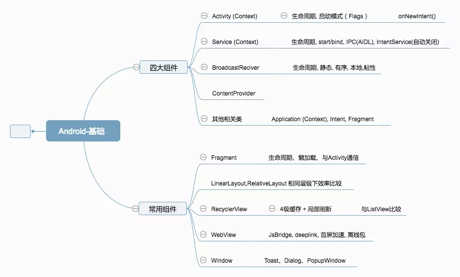
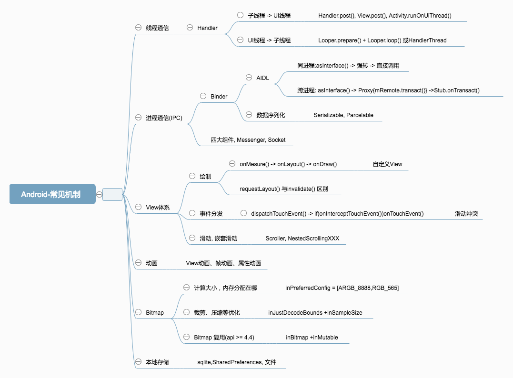
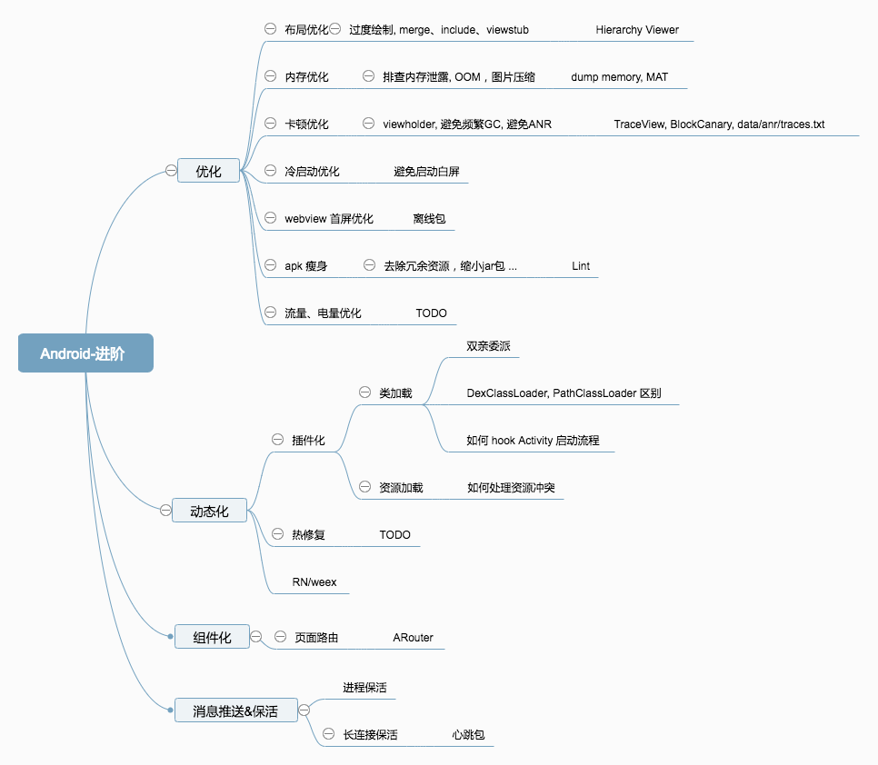
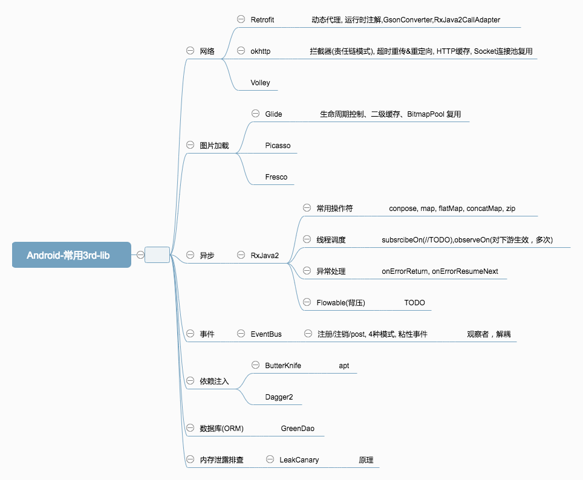

# Android 实战手册

## Y Android 知识点

### 引言
[自学入门](http://gityuan.com/2016/04/24/how-to-study-android/)

### [基础篇](./java/README.md)

#### [java 基础知识](./android_java.md)

#### [Activity](./android_activity.md)

#### [Service](./android_service.md)

#### [View](./android_view.md)

#### [BroadCast](./android_broadcast.md)

#### [ContentProvider](./android_contentprovider.md)

#### [Application](./android_application.md)

#### [Android Proguard 混淆](./android_proguard.md)

#### [Android Reflection 反射调用](./android_reflection.md)

#### [Android Permission 权限管理](./android_systempermissions.md)

#### [数据格式处理](./android_data.md)

#### [多线程](./android_thread.md)

#### [进程](./android_process.md)

#### [Android Fragment](./android_fragment.md) 

#### [动画](./android_animation.md)

#### [ViewPager](./android_viewpager.md)

#### [RecyclerView](./android_recyclerview.md)

#### [Andorid 事件分发机制](./android_event.md)

#### [Andorid 数据存储](./android_data.md)

#### [Android 稳定性 异常处理](./andorid_exception.md)

#### [Handler](./android_handler.md)

#### [Android网络相关知识](./network/README.md)

### 进阶篇

#### [性能优化专项](./android_optimize.md)

#### [插件化](./android_pulgin.md)

#### [动态加载](./hotfix/README.md)

#### [组件化](./android_module.md)

#### [Android 路由](./android_route.md)

#### [网络库](./android_network.md)

#### [图片加载框架](./andorid_imageloader.md)

#### [推送](./android_push.md)

#### [Android Binder](./android_binder.md)

#### 安全

[Android 逆向 反编译](./android_decomplie.md)

[反作弊](./android_anticheat.md)

### 高级篇

[OpenGL](./android_opengl.md)

### [Android Architecture 架构](./Architecture/README.md)

### 编码规范
* [编码规范](./android_style.md)

### 工具

* [adb](./android_adb.md)
* [Android 工具](http://www.androiddevtools.cn/)
* [android studio快捷键盘](./android_keymap.md)

### 单元测试

[在Android Studio中进行单元测试和UI测试](http://www.jianshu.com/p/03118c11c199)

### [发布](./android_publish.md)

### [开源项目](./android_open_source.md)

### [产品](../prd/README.md)

### [开发资源](android_source.md)

### 源码阅读
[Android LayoutInflater](https://www.jianshu.com/p/f0f3de2f63e3)
[Android LayoutInflater Factory 源码解析](https://juejin.im/post/5b52ee765188251b176a666d)

## 常见问题通用解决方案

#### [Android Accessibility](./Accessibility/android_accessibility.md)

#### [高斯模糊](./andorid_blur.md)

#### [主题切换](./android_theme.md)

#### [动态更换应用Icon](http://www.jianshu.com/p/eecfd9e0b878)

#### [Android Resource获取](./android_resource.md)

#### [日志](./android_log.md)

#### [悬浮窗](./android_floatwindow.md)

#### [图片颜色提取 Android Palette](./android_case.md)

#### [分辨率适配](./android_ui_adapter.md)

#### [Android卸载监听实现](http://www.jianshu.com/p/189e319a5c45)

#### [AD SDK](./market/android_4_ad_sdk.md)

#### [视屏播放相关](./android_video.md)

#### [拍摄相关](./android_camera.md)

#### [音频相关](./android_media.md)

### [Programmer](./programmer.md)

## Android Map  

---
READ MORE，
WRITE MORE，
THINK MORE，
THEN TEACH.