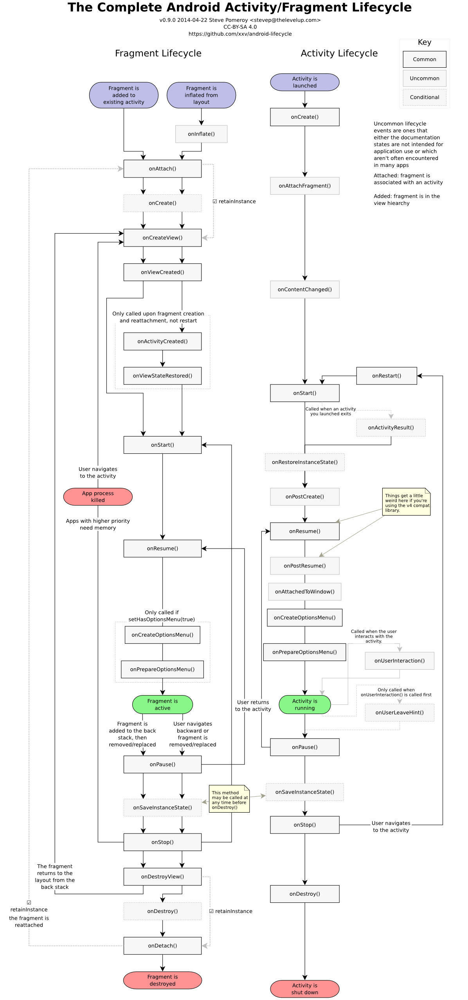

#Fragment

## 产生背景

Activity都是都是全屏处理较为简单的单一事务功能，适合于屏幕尺寸较小的智能手机，但是对于平板，有更大的显示空间，运行用户在上面处理更多的功能，例如屏幕左边是email列表，右边的某email的内容。于是在Android 3.0引入了fragment。Fragment不仅可用于平板，同样也可用于手机尺寸。

某种意义上Fragment是屏幕中的一个子activity，但是在一个屏幕显示多个activity会造成概念和逻辑的混乱，所以引入fragment的概念，可以理解为屏幕中的一块UI，可作为activity的一部分。Fragment是view的容器，加载layout，处理一小部分屏幕，它是activity的一部分。Fragment提供的UI和代码的重用，例如，在大屏幕设备中，显示左右两个fragment或者上下两个fragment（具体看orientation），在小屏幕设备中则显示其中一个fragment。

## 原理

Activity是Context的继承，而fragment是Object的继承，在android.app包中。fragment可具有层次结构的view（来自xml或者代码）。Fragment有一个bundle可以存贮数据，和activity类似，在创建时进行初始化调用，此外还有一个bundle用于保存现有状态，在onCreate(),onInflate(),onCreateView() 和onActivityCreated()都指向该对象。

一个activity可以显示多个fragment，如果fragment A被fragment B替代，则fragment A会被放入back stack中，用户按返回键时，可以重新显示fragment A。

一个fragment具有一个tag和一个ID，可用于索引

## 使用方法

## 注意事项

## 参考

[Fragment全解析系列（一）：那些年踩过的坑](https://www.jianshu.com/p/d9143a92ad94)

[Android Fragment 真正的完全解析（上）](http://blog.csdn.net/lmj623565791/article/details/37970961)

[Fragment的代码优化](http://blog.csdn.net/kan1kan5/article/details/18223429)

[Android Fragment 的使用，一些你不可不知的注意事项](http://www.jianshu.com/p/3a101ce9e04d)

[ViewPager和Fragment一篇就够了](https://www.jianshu.com/p/ad810a0bef6b)

