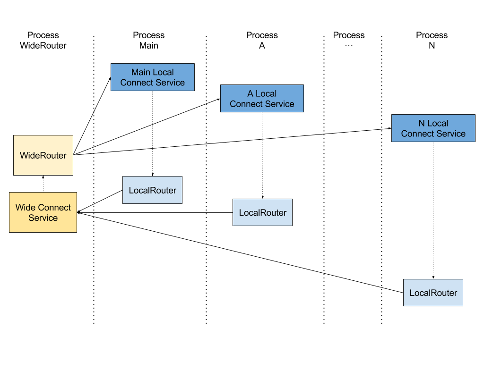

# Android组件化实践

组件化要解决的问题

1. 路由跳转，页面跳转
    * 阿里ARouter [ARouter](https://juejin.im/entry/5b72331e6fb9a009b16d42ae?utm_source=gold_browser_extension)

    * 天猫的统一跳转协议
    
    * Airbnb的DeepLinkDispatch

2. 多进程架构通信组件框架
    阿里的ARouter等方案虽然支持接口的路由，但是只是支持单进程的接口路由。
3. 

假设一个场景，除了单进程的通信需求，还有跨进程的同学需求，并且还要支持跨进程通信中的CallBack回调，甚至是全局的时间总线，这样的话，有什么样的解决方案？

爱奇艺的Andromeda就是在这样的背景下诞生[GitHub地址](https://github.com/iqiyi/Andromeda)

组件化实践方案

## 接口依赖还是协议依赖

接口依赖简单来说就是代码上依赖

协议依赖就是熟悉的Event 或者ModuleBean。作为组件间通讯的载体，统一的调用方式，每个业务模块无需定义自己的接口了。但是缺陷是
1. 虽然不用定义接口，但是为了适应业务，需要定义很多Event,如果使用ModuleBean,就要为每个ModuleBean定制许多字段，甚至调用一个空方法，也要创建一个ModulBean。这样消耗比较大，随着业务增多，这个模块对应的ModuleBean定义的字段越来越多，消耗越来越大。

2. 代码可读性差。不如直接用接口直观，用过EventBus的可以身同感受。到处到时Event，对于刚接手的人来说不是那么友好。

3. 正如微信 Android 模块化架构重构实践(上)中说到的那样，"我们理解的协议通信，是指跨平台 /序列化的通信方式，类似终端和服务器间的通信或 restful 这种。现在这种形式在终端内很常见了。协议通信具备一种很强力解耦能力，但也有不可忽视的代价。无论什么形式的通信，所有的协议定义需要让通讯两方都能获知。通常为了方便会在某个公共区域存放所有协议的定义，这情况和 Event 引发的问题有点像。另外，协议如果变化了，两端怎么同步就变得有点复杂，至少要配合一些框架来实现。在一个应用内，这样会不会有点复杂？用起来好像也不那么方便？更何况它究竟解决多少问题呢"。

## 本地服务的路由方案
一个Map就可以搞掂

## 跨进程的路由方案

* 任意两个组件能够方便的通信，即一个组件注册了自己的运程服务，任意一个组件都能轻易的调用

* 让远程服务的注册和服务像本地服务一样简单，即要实现阻塞调用

* 不能降低通信的效率

### 实现方案 封装bindService

#### WideRoute

对传统的Android IPC通信方式进行封装，即在bindService基础上进程封装，比如[ModularizationArchitecture
](https://github.com/SpinyTech/ModularizationArchitecture)中的WideRouter

这个方案两个明显缺点：
1. 每次IPC都需要经过WideRouter然后再转发到对应的进程，这样就导致原来一次的IPC可以解决的问题，变成了两次,而IPC本身就比较耗时的。
2. 由于bindService本身就是异步的， 实际上做不到真正的阻塞调用。
3. WideConnectService 需要存活到最后，这样就要求WideConnectionService需要在存活周期最长的那个进程里面，而现在无法动态配置WideConnectService所在进程，到时使用时不方便。

#### Hermes
    饿了么的开源框架，最大的特色是不需要写AIDL接口，可以直接像调用本地接口一样调用远程接口。
而它的原理利用动态代理+反射的方式来替换AIDL生成的静态代理，但是它在跨进程这方面本质上仍旧是用bindService

Hermes.connect()本质上还是 bindService()的方式，那同样存在上面的那些问题。另外，Hermes 目前还不能很方便地配置进程，以及还不支持 in, out, inout 等 IPC 修饰符。
不过，尽管有以上缺点，Hermes 仍然是一个优秀的开源框架，至少它提供了一种让 IPC 通信和本地通信一样简单的思路。

## 参考

[安居客 Android 项目架构演进](https://zhuanlan.zhihu.com/p/25420181)

[Andromeda:首个适用于多进程架构的组件通信框架](https://www.v2ex.com/t/459033) http://blog.imallen.wang/

[Android模块化实践](https://juejin.im/post/5b44a0d76fb9a04f932fe147?utm_source=gold_browser_extension)

[人人都能组件化](https://www.jianshu.com/p/81d2e0132a10)

[Android组件化开发案例](https://juejin.im/post/5cc5a98fe51d456e3f2fb796)

[微信 Android模块化架构重构实践](https://cloud.tencent.com/developer/article/1005631)

[Android组件化方案](https://blog.csdn.net/guiying712/article/details/55213884)