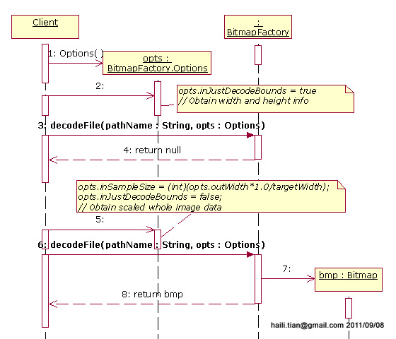
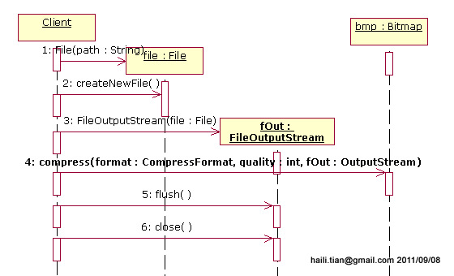

#Bitmap

Bitmap是Android系统中的图像处理的最重要类之一。用它可以获取图像文件信息，进行图像剪切、旋转、缩放等操作，并可以指定格式保存图像文件。本文从应用的角度，着重介绍怎么用Bitmap来实现这些功能。

 
一、Bitmap的生成

1.1 BitmapFactory decode出Bitmap
Bitmap实现在android.graphics包中。但是Bitmap类的构造函数是私有的，外面并不能实例化，只能是通过JNI实例化。这必然是 某个辅助类提供了创建Bitmap的接口，而这个类的实现通过JNI接口来实例化Bitmap的，这个类就是BitmapFactory。


图一、BitmapFactory主要方法及Options选项
 
利用BitmapFactory可以从一个指定文件中，利用decodeFile()解出Bitmap；也可以定义的图片资源中，利用decodeResource()解出Bitmap。

1.2 decode时的选项

在使用方法decodeFile()/decodeResource()时，都可以指定一个BitmapFacotry.Options。

利用Options的下列属性，可以指定decode的选项：

inPreferredConfig 指定decode到内存中，手机中所采用的编码，可选值定义在Bitmap.Config中。缺省值是ARGB_8888。
inJustDecodeBounds 如果设置为true，并不会把图像的数据完全解码，亦即decodeXyz()返回值为null，但是Options的outAbc中解出了图像的基本信息。
inSampleSize 设置decode时的缩放比例。
 

利用Options的这些值就可以高效的得到一幅缩略图。



图二、BitmapFactory.decodeFile()

 
先设置inJustDecodeBounds= true，调用decodeFile()得到图像的基本信息[Step#2~4]；

利用图像的宽度（或者高度，或综合）以及目标的宽度，得到inSampleSize值，再设置inJustDecodeBounds= false，调用decodeFile()得到完整的图像数据[Step#5~8]。

先获取比例，再读入数据，如果欲读入大比例缩小的图，将显著的节约内容资源。有时候还会读入大量的缩略图，这效果就更明显了。

 

二、利用Bitmap和Matrix实现图像变换

Bitmap可以和Matrix结合实现图像的剪切、旋转、缩放等操作。


图三、Bitmap方法

用源Bitmap通过变换生成新的Bitmap的方法：

```
public static Bitmap createBitmap(Bitmap source, int x, int y, intwidth, int height,  
                Matrix m, boolean filter)  
    public static Bitmap createBitmap(Bitmap source, int x, int y, intwidth, int height)  
    public static Bitmap createScaledBitmap(Bitmap src, int dstWidth,  
                int dstHeight,boolean filter)  
```

第一个方法是最终的实现，后两种只是对第一种方法的封装。

第二个方法可以从源Bitmap中指定区域(x,y, width, height)中挖出一块来实现剪切；第三个方法可以把源Bitmap缩放为dstWidth x dstHeight的Bitmap。

 

设置Matrix的Rotate（通过setRotate()）或者Scale（通过setScale()），传入第一个方法，可实现旋转或缩放。


图四、Bitmap实现旋转

 

三、保存图像文件

经过图像变换之后的Bitmap里的数据可以保存到图像压缩文件里（JPG/PNG）。



图五、保存Bitmap数据到文件

 

这个操作过程中，Bitmap.compress()方法的参数format可设置JPEG或PNG格式；quality可选择压缩质量；fOut是输出流（OutputStream），这里的FileOutputStream是OutputStream的一个子类。

 

总结一下，本文介绍Bitmap的使用方法——用Bitmap实现图像文件的读取和写入，并用Bitmap实现图像的剪切、旋转和缩放变换。

[高斯模糊](http://www.jianshu.com/p/f2352c95d391)

[有效的处理较大的位图](http://blog.csdn.net/yangxi_pekin/article/details/16989495)