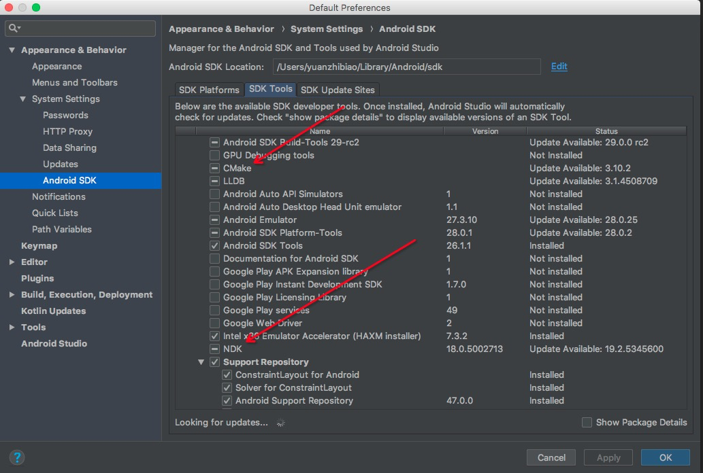
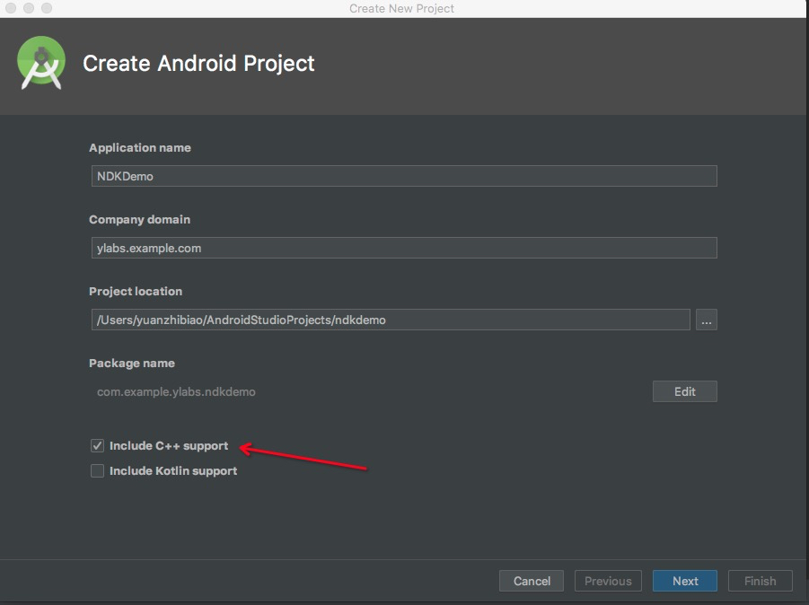
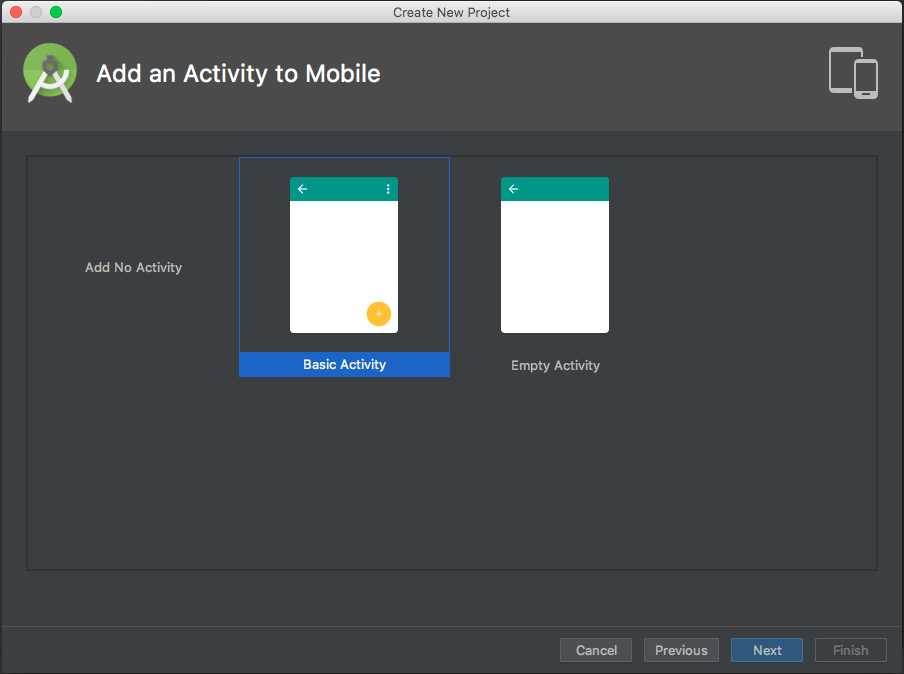
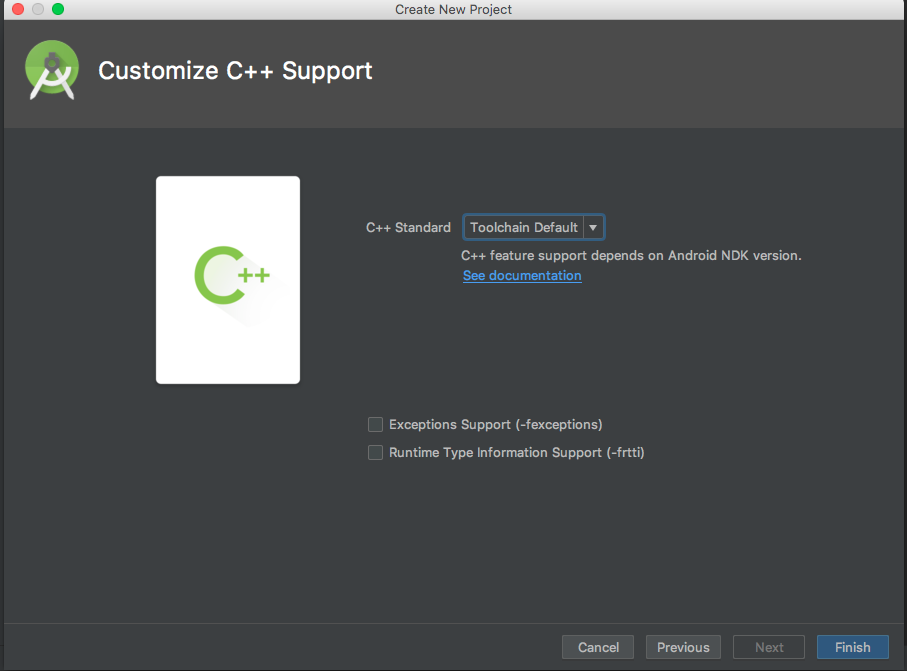
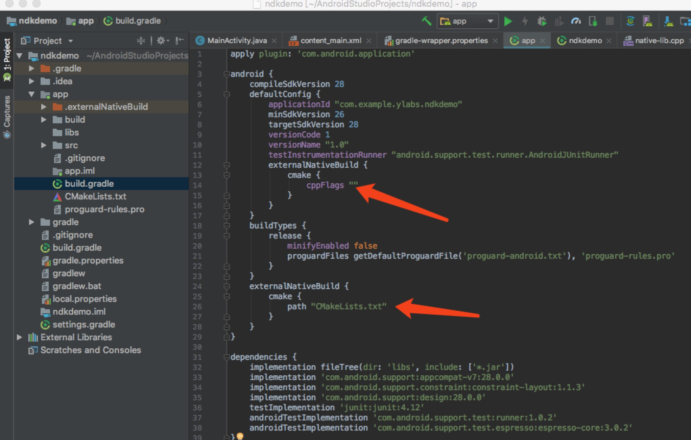

# Android JNI教程 —— HelloWorld

### 项目环境
* AndroidStudio 3.2
* Gradle gradle-4.6-all

### 创建项目

* 确保AndroidStudio支持CMake和NDK



* 创建支持NDK的工程









* 编写Native代码

1. 新建要编译成.h文件的java文件

2. 切换到java文件的类，执行以下命令，会在java目录下生成.h文件

    javac xxxx.java -h .

xxxx.h内容如下：

```java

/* DO NOT EDIT THIS FILE - it is machine generated */
#include <jni.h>
/* Header for class king_bird_ndkjnidemo_JNIUtils */

#ifndef _Included_king_bird_ndkjnidemo_JNIUtils
#define _Included_king_bird_ndkjnidemo_JNIUtils
#ifdef __cplusplus
extern "C" {
#endif
/*
 * Class:     king_bird_ndkjnidemo_JNIUtils
 * Method:    printStringByJni
 * Signature: ()Ljava/lang/String;
 */
JNIEXPORT jstring JNICALL Java_king_bird_ndkjnidemo_JNIUtils_printStringByJni
  (JNIEnv *, jclass);

#ifdef __cplusplus
}
#endif
#endif

```

3. main下新建jni文件夹，将.h文件拷贝过来

4. 编写.c或者.cpp

```java
    #include "king_bird_ndkjnidemo_JNIUtils.h"
    //king_bird_ndkjnidemo_JNIUtils_printStringByJni 包名+文件名+文件内方法名
    JNIEXPORT jstring JNICALL Java_king_bird_ndkjnidemo_JNIUtils_printStringByJni
            (JNIEnv *env, jclass jclass){
        //字符串返回
    return env->NewStringUTF("没想到吧！我竟然会JNI了！！！");
    }
```

### 原理

## 参考

[NDK开发第一课：环境配置与第一个JNI程序](https://blog.csdn.net/afei__/article/details/80897404)

[]()